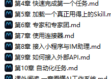
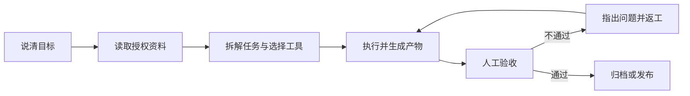
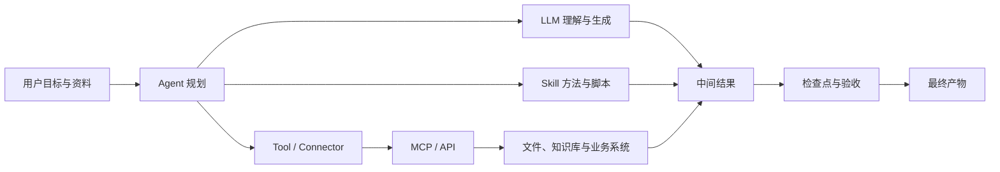

# 第一篇 使用手册：先把 OmniX 用起来




> 来源：OmniX 实战蓝皮书（https://OmniX.homes/bluebook/）


---


## 第 1 章 初识 OmniX


**OmniX** 是腾讯最新推出的全场景职场 AI 智能体工作台，


面向 人力资源、行政、运营、销售、研发等不同职场角色，是一款能够像真正同事一样思考、执行任务并交付结果的 AI 办公应用。


## 从“回答问题”到“交付结果”


与传统 AI 助手不同，OmniX 不只是陪用户聊天、回答问题或者给出建议。


用户只需要用一句自然语言描述需求，它就可以理解任务目标，在本地电脑中自主规划执行步骤，并完成复杂的多模态任务。


在获得用户授权后，OmniX 可以读取和处理本地文件，自动完成批量文件处理、文档生成、表格分析、PPT 制作、多模态内容创作、行业调研、本地知识库构建等工作。


对于更加复杂的任务，它还可以自主拆解步骤，并通过多个智能体（Agents）并行，减少人工在不同工具、文件和任务之间反复切换的成本。





例如，用户可以直接告诉 OmniX，分析这个文件夹中的销售数据，并生成一份汇报 PPT。


·

OmniX 会自主读取相关文件，理解数据内容，完成分析和总结，并生成最终可以查看和修改的工作成果。


整个过程中，用户不需要手动上传每一个文件，也不需要一步一步告诉 AI 下一步应该做什么。


OmniX 面向的是完整的工作任务。


它的核心能力可以概括为三点，**听得懂人话，能够自主思考规划，也真的能够操作电脑交付成果。**


为了完成不同类型的任务，OmniX 还提供了多模型切换（混元/DeepSeek/GLM/Kimi/MiniMax 等）、MCP Server、Skills 技能包等能力。


用户可以根据不同任务选择合适的模型，也可以通过 MCP 和 Skills 扩展 OmniX 的工具和专业能力。


同时，针对本地文件操作、终端执行等场景，OmniX 还提供高危指令拦截和权限控制机制，降低 AI 自主执行过程中的风险。


想对OmniX打分，可以去[观猹](https://watcha.cn/)，写出你对OmniX的真实评价～


---


## 第 2 章 OmniX的下载、安装、登录与更新


## OmniX下载


下载OmniX，点击官方地址（<https://www.codebuddy.cn/work/），选择OmniX，点击“下载OmniX”即可下载。>


网站会自动检查你当前设备，判断你是什么版本，Mac ARM64、Mac x64或者Windows x64。


***切记：从官方入口进入下载，不从网盘或不明镜像获取安装包。***


## Windows 安装


1. 下载完成后双击安装文件。


1. 如系统弹出安全提示，先核对发布者与下载来源，再决定是否继续。


2. 按安装向导完成安装并启动 OmniX。


3. 进入准备运行环境


## macOS 安装


1. 打开安装文件，将 OmniX 拖入“应用程序”；


2. 从“应用程序”启动；


## 登录


点击登录按钮


自动跳转网页登录


选择微信扫码登录，也可以手机号登录


完成后，即可使用OmniX进行工作


*PS：若公司电脑禁止安装软件，不要绕过终端安全策略，应联系 IT 管理员确认白名单或企业部署方式。*


## 更新


点击左下角个人中心，选择“检查更新”，检查是否有新版本，若有新版本，可更新


## 常见问题


### 安装包打不开或提示损坏


先删除安装包并从官网重新下载，核对系统和芯片版本。仍失败时记录系统版本、安装包名和报错截图，通过官方反馈渠道处理，不要随意关闭系统安全功能。


### 登录后没有反应


检查默认浏览器是否拦截登录回跳、网络代理是否影响认证、系统时间是否准确。退出应用后重试，并保留日志与截图。


### 无法读取或写入文件


确认任务选择的工作目录是否正确、系统是否授予对应目录权限、文件是否被其他程序锁定。先用一个空白文本文件测试，不要直接拿重要文件反复试错。


### 更新前要不要备份


应用更新一般不应修改工作文件，但长期项目仍应把输入、产物、配置和自定义 Skill 纳入版本管理或定期备份。


---


## 第 3 章 OmniX 的主界面、任务与工作区


OmniX 主界面可以理解为三个区域：左侧（侧边栏）管理任务，中间（对话区）下达和追踪任务，右侧（结果区）查看文件、变更、预览和最终产物。


## 三个区域分别做什么


区域| 主要用途| 使用时重点检查

\---|---|---

侧边栏| 新建、搜索、切换和管理任务| 是否进入了正确任务

对话区| 描述需求、补充信息、确认计划| 目标和约束是否完整

结果区| 查看产物、全部文件、变更与预览| 文件名、路径和改动是否符合预期


侧边栏的“任务”和“工作空间”的区别，在于你是否设置了“工作空间”目录。


“工作空间”是 OmniX 为了管理任务而设置的目录，每个任务都有一个对应的目录空间，任务可以在目录空间内进行操作。


若未设置，会在默认安装的目录下执行任务，对话保存在“任务”目录下。


## 为什么要隔离工作目录


工作目录既是效率设置，也是安全边界。把发票、周报、客户材料混在同一个大目录里，会增加误读、误改和信息串用的风险。


推荐按任务建目录空间。


同时，可以对目录空间的权限进行设置，当开启“允许完全访问”（开启完全访问后智能体可读写授权目录外文件，请谨慎使用并优先按任务限定目录。）


## 三种工作模式


OmniX 提供三种工作模式：


模式| 中文界面| 能做什么| 适合场景

\---|---|---|---

Ask| 问一问| 问答、理解和查看，不修改文件| 先了解资料、确认需求

Craft| 做一做| 可直接操作本地文件、运行代码及系统指令| 路径清楚、风险较低的任务

Plan| 想一想| 先生成计划，确认后再执行| 多步骤、跨系统、重要文件任务


## 选择不同的模型


默认为自动模式，可以指定你想使用的模型，不同模型积分消耗不同。


任务特征| 优先关注

\---|---

大量文本与长资料| 上下文长度，比如 100 万 tokens（1M）

图片与截图| 需要有视觉理解能力

高频简单任务| 优先选择响应速度快、成本较低的模型


---


## 第 4 章 快速完成第一个 OmniX 任务


## 快速创建一个 OmniX 任务


1. 点击“新建任务”；


2. 选择或创建独立工作目录；

*PS：OmniX 采用文件夹级授权与高危拦截，首次操作请先在演练目录进行、留意授权范围，处理真实业务数据前谨慎确认*


3. 判断应该使用模式，默认为Craft，还可以设置成Ask或Plan；


4. 选择模型，可以指定你想使用的模型，不同模型积分消耗不同。


5. 输入任务说明，“帮我分析一下《电商销售数据.xlsx》数据，生成一份汇报 PPT。”


6. 如有必要，指定 Skill、专家、连接器或资料库，这里暂时忽略


7. 发送后观察计划、工具调用和文件变更；


8. 在结果区预览产物并验收。

文件可以本地打开、上传云端、或分享，注意分享前先确认产物不含敏感或涉密信息，按公司规范选择共享范围。


## 如何写一个任务说明


要素| 要回答的问题

\---|---

目标| 最终要解决什么问题

输入| 使用哪些文件、目录或链接

动作| 需要分析、整理、转换还是生成

约束| 哪些不能改，采用什么规范

输出| 交付什么文件，放到哪里

验收| 用什么标准判断合格


### 入门任务 A：整理文件


text

\[code\]

```
目标：整理 input 目录中的练习文件，便于按类型查找。

输入：仅处理当前工作区的 input 目录。

动作：识别文件类型，提出分类和重命名方案。

约束：不删除、不覆盖原文件；重名时保留两份并标记序号。

输出：先生成 inventory.xlsx 和 proposed-actions.md。

验收：清单文件数与 input 实际文件数一致，所有动作可追溯。

在我确认 proposed-actions.md 前，不移动文件。
```

\[/code\]


### 入门任务 B：生成会议纪要


text

\[code\]

```
请把 input/meeting.txt 整理为结构化会议纪要。

必须包含：会议结论、待办事项、负责人、截止日期、待确认问题。

不能从原文确认的负责人或日期写“待确认”，不要自行补全。

输出 output/会议纪要.md 和 output/待办清单.xlsx。

验收：每一项结论可以在原文找到依据；待办不遗漏负责人和时间状态。
```

\[/code\]


### 入门任务 C：Word 转 PPT


text

\[code\]

```
把 input/项目汇报.docx 转成 10 页以内的内部汇报 PPT。

受众：部门负责人；汇报时长：8 分钟。

保持原文事实和数字，不新增未经证实的数据。

结构：背景、现状、问题、方案、计划、需要决策。

使用 reference/brand-guide.pdf 中的颜色与字体规范。

输出 output/项目汇报_v1.pptx，同时提供逐页内容清单。

验收：每页只有一个核心观点，数字与原文一致，正文在投影状态可读。
```

\[/code\]


---


## 第 5 章 OmniX加载一个真正用得上的 Skill


## Skill 是什么


OmniX 本身负责理解任务和组织执行；Skill 则是一组可复用的说明、脚本、参考资料和资源，告诉 Agent 某类任务应该怎样做、调用什么工具、交付什么格式。


Anthropic 在 2025 年 10 月正式推出 Agent Skills，2025 年 12 月将其发布为开放标准。


一个最标准的 Skill，大概长这样：


Plain

\[code\]

```
my-skill/

├── SKILL.md

├── scripts/

│   └── check.py

├── references/

│   └── guide.md

└── assets/

    └── template.pptx
```

\[/code\]


其中只有 `SKILL.md` 是必须的。


Markdown

\[code\]

```
---

name: tech-article-writing

description: 用于撰写 AI 产品、模型评测和科技行业相关文章

---


收到写作任务后：


1. 先确认文章核心角度

2. 查找一手资料

3. 对核心事实交叉验证

4. 根据用户写作风格完成初稿

5. 检查禁用句式和 AI 味表达
```

\[/code\]


还可以带上：


Plain

\[code\]

```
references/style.md
```

\[/code\]


## Skill 是怎么工作的


Skill 最关键的设计，其实不是 SKILL.md，而是 Progressive Disclosure，渐进式披露。


假设你的 Agent 装了 100 个 Skill。


它不会一上来把 100 个 Skill 的完整内容全部塞进上下文。这样不仅浪费 Token，还会让模型被大量无关指令干扰。


标准做法分三层。


第一层，Agent 启动时只看所有 Skill 的名称和 description。


比如：


Plain

\[code\]

```
pptx

处理 PowerPoint 创建、编辑、读取任务


pdf

处理 PDF 提取、合并、编辑、填写任务


tech-article-writing

撰写 AI 和科技行业文章
```

\[/code\]


第二层，当用户说：


Plain

\[code\]

```
帮我写一篇 OmniX 的公众号文章
```

\[/code\]


Agent 根据 description 判断 `tech-article-writing` 可能相关，这时才加载完整的 `SKILL.md`。


第三层，执行过程中发现需要模仿你的写作风格，才继续读取：


Plain

\[code\]

```
references/style.md
```

\[/code\]


需要检查 AI 味，才执行：


Plain

\[code\]

```
scripts/check-ai-phrases.py
```

\[/code\]


标准规范建议，所有 Skill 启动时只加载数十至上百Token的元数据，Skill 激活后再加载完整说明，其他资料和脚本继续按需读取。OpenAI Codex 也采用类似机制，先向模型暴露 Skill 的名称、描述和路径，再在模型决定使用时读取完整内容。


所以 Skill 解决了一个长期困扰 Agent 的问题：


**怎么给 Agent 很多知识和工作方法，又不把所有东西永远塞在 Prompt 里。**


## Skill 跟 Prompt 到底有什么区别


这是最核心的问题。


维度| Prompt| Skill

\---|---|---

核心作用| 描述当前任务| 定义一类任务怎么做

生命周期| 通常针对一次请求| 长期复用

触发方式| 用户主动输入| Agent 自动选择或用户显式调用

载体| 主要是文本| 文件夹

内容| 指令、上下文、示例| 指令、脚本、资料、模板、资源

上下文占用| 通常直接进入上下文| 按需加载

复用| 经常复制粘贴| 原生可复用

分享| Prompt 文本| 完整能力包

执行| 本身只是指令| 可以调用附带脚本和工具

模型参数| 不改变| 同样不改变


最简单的理解是：


Plain

\[code\]

```
Prompt = 任务

Skill = 做法
```

\[/code\]


## Skill 有哪些作用


\*\*第一个作用，是给模型补充程序性知识。\*\*大模型往往知道大量知识，但未必知道你的事情具体应该怎么做，比如它知道 SQL，但它不知道你公司的：


Plain

\[code\]

```
canonical user_id 在哪张表

subscriptions 表是 append-only

查询退款时必须排除某个状态

Grafana 对应 dashboard ID 是多少
```

\[/code\]


这些知识非常适合做 Skill，Anthropic 在内部使用了数百个 Skill，最终发现主要集中在 API 和内部库使用、产品验证、数据分析、业务流程自动化、代码脚手架、代码审查、CI/CD、故障 Runbook 和基础设施运维九类场景。


\*\*第二个作用，是固定复杂工作流，\*\*比如做一次行业调研。


普通 Prompt 可能是：


Plain

\[code\]

```
详细调研一下 OmniX
```

\[/code\]


模型每一次都会重新思考：


Plain

\[code\]

```
去哪里找资料

先查什么

怎么验证

跟谁对比

输出什么结构
```

\[/code\]


Skill 可以把流程固定下来：


Plain

\[code\]

```
1. 官方网站

2. 官方公众号和发布会

3. 产品文档

4. 实际产品测试

5. 同类产品对比

6. 核心观点提炼

7. 事实核验
```

\[/code\]


这种能力称为 Encoded Preference Skill。模型本来能完成每一个单独步骤，但 Skill 把这些步骤按照团队或个人的工作方式组织起来。


另一类是 Capability Uplift Skill，给模型补充它原本做不好或不稳定的能力，例如复杂文档、PDF 和 PPT 处理。


**第三个作用，是减少重复 Prompt。**


你现在跟 AI 合作，其实有大量内容是在重复说，比如你经常告诉我：


Plain

\[code\]

```
不要写得太 AI

长短句结合

不要过度点列

要有自己的判断

技术内容要克制

不要编造例子
```

\[/code\]


这些其实已经天然适合做成一个 `writing-style` Skill。


以后你的 Prompt 只需要：


Plain

\[code\]

```
写一篇 OmniX 文章
```

\[/code\]


写作习惯、资料标准、禁用表达、文章流程，都由 Skill 提供。


**第四个作用，是把个人经验和组织经验资产化。**


传统 Prompt 最大的问题是容易散落在：


Plain

\[code\]

```
聊天记录

飞书文档

Notion

个人脑子里
```

\[/code\]


Skill 是文件，所以它可以：


Plain

\[code\]

```
Git 管理

版本回滚

团队共享

A/B 测试

自动评测

持续更新
```

\[/code\]


这件事情很关键。


## OmniX里找到合适的Skill


打开左侧“专家·技能·连接器”，可以从技能市场搜索，也可以用“查找技能”描述需求。


也可以在SkillHub技能市场里找到合适的Skill


除了从推荐列表里直接安装，还可以**导入自己下载的技能** 。


比如你在网上看到一个好用的技能包，下载下来是一个 zip 压缩文件，操作流程是这样的：点击"上传技能"，把 zip 文件加载即可


## 使用Skill解决一个任务


比如，你让AI写了一篇文章，需要去除AI味，你可以找到“文章去AI味工具 ”Skill，安装之后，使用时，直接 “/” 可以换出。


你只需要引用Skill内容，把文章给到即可，


OmniX 会先加载skill的内容，


根据skill中的规则，来执行，比如要去除不是而是、双引号等内容，


修改之后，可以得到结果，确实去除了AI味。


## Skill的关闭和卸载


从全部技能中，点击我安装的


按钮关闭（则关闭该Skill）


点击“···”，可以选择删除或编辑该Skill


---


## 第 6 章 OmniX的专家和专家团


## 专家和专家团与Skill的区别


OmniX 本身是一个通用 Agent，什么任务都能接。但通用不意味着每个领域都应该用同一种方式处理。


比如，


同样是分析一份销售数据，普通 Agent 可能会读取数据、生成图表、总结趋势。数据分析专家会先理解业务目标，再确定核心指标，检查数据质量，寻找异常变化，分析可能原因，最后给出可以执行的业务建议。


同样是写一篇小红书文案，普通 Agent 可能更关注内容本身。小红书运营专家还会考虑选题、标题、开头留存、种草逻辑、平台内容生态和互动设计。


专家定义为一种角色切换机制，通过人设、方法论和工具链，让 OmniX 以特定领域专家的身份执行任务。


最简单的理解是：


普通 OmniX = 通用 AI 同事


专家 = 有明确岗位和专业经验的 AI 同事


而专家团定义为一种协作执行机制。一个专家团由多位专家组成，由团长自动拆解任务、分配工作、并行执行，最后整合交付。


用户只需要告诉团长客户背景、最新需求和预期成果，不需要自己挑选团员，也不需要自己拆分任务。团长会安排内容、活动、分析等成员协作，最后汇总完整方案。


方式| 本质| 适合的问题

\---|---|---

普通任务| 通用理解与执行| 一次性的清楚任务

Skill| 特定工具能力| 需要稳定执行某个动作

专家| 人设 + 方法论 + 工具链| 明确领域的单点专业问题

专家团| 多位专家 + 协作流程| 需要拆解、并行、汇总的复杂项目


## 召唤一位专家


1. 打开“专家·技能·连接器”，选择“专家”；


2. 点击“召唤专家”；以“高考我帮你”专家举例


3. 提供任务内容，比如“帮我查一下2026年高考数学真题”


4. 等待结果

## 创建一位专家


点击我的专家，创建专家，即可


比如创建一个公众号创作专家，


生成结束，可以测试


在我的专家中，也可以找到。


## 召唤一个专家团


专家团由团长负责拆解和汇总，成员按角色并行或串行执行。任务开始前先确认：成员分工是否覆盖完整、哪些步骤依赖前一步、什么时候需要人来拍板、最终由谁整合。


打开“专家·技能·连接器”，选择“专家团”，点击召唤


---


## 第 7 章 OmniX 使用连接器


**MCP** 指的是 \*\*Model Context Protocol（模型上下文协议），\*\*是由 Anthropic 于 2024 年底推出并开源的一个开放标准协议，目前已经成为 AI 领域最热门的基础设施之一。


用一个通俗的比喻：**MCP 就是 AI 世界的“USB-C 接口”。**


## 为什么需要 MCP？


在过去，如果你想让一个 AI 助手（Agent）连接外部工具（比如 GitHub、本地文件系统、PostgreSQL 数据库、Slack 等），开发者必须为“每一个 AI 应用”和“每一个工具”编写专门的对接代码。如果有 10 个 AI 应用和 10 个工具，就需要写 100 个接口（N × M 的集成噩梦）。


有了 MCP，工具开发者只需要按照 MCP 标准开发一个“MCP Server”（相当于 USB-C 设备），而任何支持 MCP 的 AI 应用（如 Cursor、各类 Agent 框架）只需内置“MCP Client”（相当于 USB-C 接口），就能**即插即用** 。这就把 N × M 的复杂开发工作，简化成了 N + M。


## MCP 的核心特点


- 统一的标准化协议（告别重复造轮子）

MCP 提供了一套通用的规范（基于 JSON-RPC）。无论是读取本地文件、查询数据库，还是调用第三方 SaaS API，AI 都能通过同一套协议逻辑去理解和调用。这大幅降低了 Agent 开发中工具集成的门槛，让开发者可以把精力集中在 Agent 的核心逻辑上，而不是写繁琐的 API 对接代码。


- 支持三大核心能力

MCP 不仅能让 AI “做事”，还能让 AI “看数据”和“按套路出牌”，它标准化了三种核心原语：


- **Tools（工具）** ：允许 AI 执行操作。例如：运行一段代码、在 Jira 创建一个任务、向数据库写入数据。
- **Resources（资源/上下文）** ：允许 AI 读取外部数据。例如：获取 Git 仓库的文件列表、查询向量数据库中的特定片段，作为回答问题的上下文。
- **Prompts（提示词模板）** ：提供预定义的交互模板，让用户或 AI 能以标准化的方式触发特定的复杂工作流。
- C/S 架构与高度解耦，MCP 采用客户端-服务端（Client-Server）架构：
  - **MCP Host** ：你使用的 AI 宿主应用（如 IDE、Agent 平台）。
  - **MCP Client** ：Host 内部负责与 Server 保持 1:1 连接的组件。
  - **MCP Server** ：轻量级的独立程序，专门负责暴露特定工具或数据的能力。

这种解耦意味着你可以随时替换底层的大模型，或者随时增加新的数据源，而无需重构整个 Agent 系统。


- 本地优先与安全性（隐私友好）

MCP 支持通过本地标准输入输出（stdio）或本地 HTTP 进行通信。这意味着你的 MCP Server 可以完全运行在本地电脑上。敏感数据（如本地代码、私有数据库内容、电商后台数据）不需要上传到云端第三方服务器，AI 模型只在需要推理时获取必要的上下文，极大提升了企业级应用的数据安全性。


## 加载一个连接器


**当前已支持 QQ 邮箱、腾讯文档、腾讯乐享、腾讯会议、TAPD 等连接器。**


比如加载腾讯会议连接器，


## 创建一个任务


帮我创建一个明天下午 3 点的会议，


主题“项目讨论”，时长1h


创建成功


## 新建连接器


连接器管理页右上角点“自定义连接器”，按引导配置 MCP（含服务地址、鉴权方式），并提示自定义连接器的访问范围由用户配置


---


## 第 8 章 OmniX 接入小程序与 IM 助理


## 小程序的两种模式


模式| 任务在哪里运行| 是否依赖电脑在线| 适合任务

\---|---|---|---

本机模式| 已连接的电脑| 是| 本地文件、本地 Skill、已有工作区

云端模式| 隔离的云端环境| 否| 调研、写作、临时分析、并行任务


**首次使用**


1. 通过官方入口打开 OmniX 小程序并登录；
2. 查看当前处于本机还是云端模式；
3. 本机模式下确认目标电脑在线且连接正确；

## IM 助理的工作链路

\[code\]

```
sequenceDiagram

    participant U as 手机 IM

    participant B as 应用机器人

    participant W as OmniX 助理

    participant P as 本机工作区

    U->>B: 发送任务

    B->>W: 回调或长连接传递消息

    W->>P: 在授权目录执行

    P-->>W: 产物与状态

    W-->>B: 返回结果

    B-->>U: 手机查看与确认
```


\[/code\]


## 接入微信助理：扫码绑定即可


1. 打开 OmniX，在左侧“助理”栏点击齿轮，进入“助理设置”；


2. 找到“微信助理集成”，点击“配置”；


3. 等待绑定二维码生成，用手机微信扫码；


4. 卡片显示“已绑定”后，先发送一条只读测试指令；


5. 需要切换微信账号时，先解绑当前账号，再重新扫码。

二维码有时效限制。停留在“绑定中”、二维码过期或扫码失败时，关闭配置窗口后重新进入，必要时重启 OmniX 并重新生成二维码。


***来源：OmniX 官方指南。***


## 接入飞书


1. OmniX → 设置 → 助理设置 → 选择飞书；


2. 在飞书开放平台创建企业自建应用；


3. 为应用添加机器人能力；


4. 按 OmniX 当前页面要求开通最小权限；


5. 在“凭证与基础信息”获取 App ID 和 App Secret；


6. 将凭证填写到 OmniX，生成或复制回调信息；


7. 在飞书配置事件订阅与回调；


8. 添加接收消息、卡片交互等当前指南要求的事件；


9. 创建版本并发布应用；


10. 在飞书内向机器人发送只读测试任务。

***来源：OmniX 官方指南。***


## 接入钉钉


1. 创建应用与机器人使用企业管理员账号登录钉钉开发者后台；


2. 进入“应用开发”，创建应用；


3. 为应用添加机器人能力，填写机器人名称、描述和头像并确认发布；


4. 优先在测试组织或测试群完成验证。


***来源：OmniX 官方指南。***


---


## 第 9 章 如何接入外部 API


你也许没有积分，但是你有自己的LLM API，


OmniX支持接入其他 LLM 的 API，以及 Coding Plan、Token Plan 等套餐。


直接从设置中进入，


选择模型选项，


点击添加模型，


可以选择各种coding plan或者自定义的api


比如，DeepSeek，你只需要输入api key即可，


或者接入本地ollama模型，需先本地启动 Ollama（默认端口 11434，OpenAI 兼容接口），本地模型优势为数据不出本机、可离线、零 Token 成本。


---


## 第 10 章 OmniX 自动化任务


真正消耗人的，往往不是那些需要创造力的大任务，而是每天都要打开同样的页面、收集相似的信息、整理成同一种格式，再把结果发给同一批人。OmniX 自动化的价值，就是把这些“时间固定、步骤相似、结果可检查”的工作变成可重复运行的 Agent 任务。


## 为什么 OmniX 可以自动化


传统自动化通常要求人先把每一个步骤写成代码：打开哪个系统、点击哪个按钮、读取哪一列、遇到异常怎么分支。


OmniX 的不同之处，是把“定时调度”与 Agent 的理解、工具调用和文件处理能力组合起来。你不必把所有细节都写成程序，但需要把目标、输入、边界和结果说清楚。


自动化配置保存在本地客户端，包括任务名称、提示词、调度规则、工作目录和执行状态。到达设定时间后，OmniX 会沿用当前登录身份发起 Agent 任务，并按提示词调用模型、Skill、MCP 或连接器，在指定工作目录完成查询、汇总和文件处理。


真正让任务稳定运行的是五个要素：明确的触发时间、可重复的输入来源、足够具体的 Prompt、固定且受控的工作目录，以及能够判断成功或失败的验收条件。


## 自动化能用来做什么


最直观的用途是把每天、每周、每月都要重复的工作交给 OmniX。价值不只在于少点几次鼠标，而在于任务不会因为忙碌而被遗忘，执行方法也不会随着不同的人临时变化。


场景| 可以自动完成| 典型产物

\---|---|---

资讯与情报| 定时搜索行业新闻、政策、竞品动态，去重后摘要| 每日简报、风险提示、来源清单

日报与周报| 汇总任务、日历、文档和数据变化，按固定结构生成报告| 日报、周报、项目进度表

数据与表格| 收集文件、合并表格、清洗字段、检查缺失和异常| 对账表、异常清单、趋势图

文件管理| 按日期和项目归档、批量重命名、抽取 PDF 或图片文字| 归档目录、索引、处理日志

内容运营| 收集选题、生成标题候选、整理素材、制作发布草稿| 选题库、内容草稿、封面需求单

知识管理| 定时整理收藏、会议纪要和灵感，补标签与来源| 知识卡片、每周回顾、待消化列表

产品与研发| 巡检日志、汇总 issue、检查依赖和构建结果| 巡检报告、缺陷摘要、升级建议

个人事务| 生成学习计划、阶段复盘、预约或提醒类任务| 学习清单、提醒、执行记录


## 什么样的任务适合先自动化


可以用下面六个问题做判断。回答“是”越多，越适合作为第一批自动化任务：


1. **会重复吗** ：至少每周发生一次，而不是一次性需求；
2. **输入稳定吗** ：文件夹、网页、表格或连接器来源相对固定；
3. **步骤相似吗** ：虽然内容变化，但处理方式基本一致；
4. **结果可验收吗** ：能检查条数、字段、时间范围、来源或文件是否生成；
5. **失败可恢复吗** ：失败后可以重跑，不会立即造成不可逆损失；
6. **权限可控制吗** ：可以限定工作目录、账号和允许调用的工具。

最适合的起点，通常不是“替我运营整个公司”，而是“每天 8 点收集 10 条 AI 行业新闻，去重、保留链接，生成 Markdown 简报到指定目录”。范围越清楚，越容易发现问题并逐步改进。


## 从一句想法到可运行任务


创建自动化前，先把口头需求改写成一份小型任务说明。一个可靠的 Prompt 至少要回答：何时执行、读取什么、怎样处理、输出到哪里、怎样算完成、失败后怎么办、哪些动作禁止执行。


text

\[code\]

```
任务名称：每日 AI 行业简报

触发时间：每天 08:00，时区 Asia/Shanghai

工作目录：automation/ai-daily


输入：

- 检索过去 24 小时的 AI 产品、模型和行业新闻

- 仅使用可以访问并保留链接的公开来源


处理规则：

1. 合并重复事件，按产品、技术、商业三类整理

2. 每条包含标题、100 字摘要、来源、发布时间和链接

3. 无法确认发布时间或来源的内容放入“待核验”，不要编造


输出：

- 保存为 YYYY-MM-DD-ai-daily.md

- 正文最多 10 条，最后附来源清单
```

\[/code\]


## 创建一项自动化任务


在 OmniX 打开“自动化”页面，可以查看已安排任务和历史执行记录。点击“添加”后，需要配置任务名称、工作空间、提示词、模型与技能、定时规则，以及是否把完成结果推送到 OmniX 小程序。


配置项| 作用| 填写建议

\---|---|---

名称| 区分不同自动化任务| 写清对象和频率，如“每日 AI 简报”

工作空间| 限定执行目录和文件保存位置| 为每项自动化使用独立目录，避免互相覆盖

提示词| 描述目标、步骤、输出和边界| 使用上面的任务模板，不只写一句口号

模型和技能| 决定可用的理解与执行能力| 只选择任务真正需要的 Skill 和连接器

定时规则| 设置频率和生效日期| 先低频试运行，再逐步提高频率

推送到小程序| 完成后在手机查看结果| 开启前确认哪些结果会通过安全链路同步到云端


点击“自动化”，


“添加自动化”，就可以自定义你的任务


比如，每日AI资讯新闻推送，定时8点发送


## 不想从零写 Prompt，可以先用模板


官方任务模板覆盖新闻推送、周报生成、体检预约和学习计划等常见场景。模板的价值是提供基本字段和任务结构，但它不是最终答案。选用后仍应修改数据来源、时间范围、输出位置、验收标准和禁止动作。


## 更多值得尝试的自动化场景


任务| 触发方式| 建议保留的人工检查

\---|---|---

周报汇总| 每周五读取本周任务、日历和交付文件| 确认进度和风险表述后再发送

销售日报| 每天汇总 CRM 或表格中的新增客户与跟进记录| 核对金额、客户状态和负责人

费用与发票整理| 每月读取指定目录中的票据和报销表| 财务提交前核对税额、重复票据和归属

自媒体选题雷达| 每天收集热点、行业话题和评论区问题| 人工判断品牌立场和是否追热点

知识库周回顾| 每周整理新增笔记、收藏和会议纪要| 确认分类、来源和是否值得长期保留

项目风险巡检| 每天检查延期任务、构建结果和错误日志| 严重告警交由负责人确认处置

竞品价格监控| 定时读取公开页面或授权 API| 页面结构变化时暂停并修复解析规则

学习计划复盘| 每天提醒，周末汇总完成情况| 根据真实精力调整下周计划


---


## 课外阅读：一章看懂 AI 工作系统


## 先看全景：一次 AI 任务里发生了什么





这张图可以用一句话解释：**模型负责理解和生成，Agent 负责围绕目标组织行动，Skill 提供专业方法，工具与 MCP/API 让行动触达真实世界，人负责边界与验收。**


把一次真实任务拆开看，信息大致这样流动：


你提出一个目标 → Agent 把它拆成几步 → 遇到专业子任务就加载对应的 Skill，遇到要碰外部系统就调用工具 → 工具通过 MCP 或 API 真正读写数据库、发消息、改文件 → 结果回到模型，模型判断下一步 → 你做边界把控和最终验收。


五类角色里，**模型是大脑，Agent 是调度员，Skill 是专家手册，工具与接口是手脚，人是裁判** 。后面每一节就是把其中一个角色讲清楚，顺便标出它能和不能的边界。


## LLM：会根据上下文预测内容的基础模型


LLM 是 Large Language Model，大语言模型。它从大量数据中学习语言和知识模式，根据当前输入生成最可能的后续内容。


它本质上是个「预测下一个内容」的引擎，不是数据库，也不是会替你负责的人。


### 它擅长什么


- 理解、归纳和改写文本；
- 从材料中提取结构；
- 生成草稿、方案和代码；
- 根据示例模仿格式和风格；
- 在工具返回结果后继续分析。

### 它不天然保证什么


- 不保证每个事实都正确；
- 不知道企业最新内部状态，除非提供资料或连接系统；
- 不会因为语言自信就拥有真实证据；
- 不自动拥有文件、账号、数据库和网络权限；
- 不承担业务和法律责任。

### 为什么会「幻觉」


模型的目标是生成连贯内容，不是内置事实数据库。当资料缺失、问题含糊或要求它给出确定答案时，它可能用合理但不真实的内容填补空白。


这不是 bug，是「按概率补全」这件事的副作用。理解了这点，你就不会再追问「它明明说得很肯定，为什么是错的」——肯定和正确是两件事。


### 降低幻觉的办法


- 提供可靠资料；
- 要求引用位置（说清楚结论来自哪段材料）；
- 允许回答「无法确认」；
- 把事实提取与建议生成分开；
- 对高影响结论人工复核。

## Token 与上下文窗口：模型眼前能看到多少


Token 是模型处理文本的基本单位，不完全等于字数。中文里一个字可能对应一个或几个 Token，代码和标点也单独计费。上下文窗口是一次推理中模型能够处理的输入、历史对话和输出总量。


把 Token 想成模型的短期记忆容量：装得下才看得见，装不下就得丢或压缩。


### 上下文变长不一定更好


把所有文件和几个月对话都塞进一个任务，可能导致：


- 旧要求与新要求冲突；
- 关键资料被大量无关内容淹没；
- 成本和等待时间增加；
- 模型引用了过期版本。

窗口越大，越容易「水漫金山」——重要的反而被冲淡。


### 更稳妥的做法


按项目整理「当前规则、已确认事实、决策记录和本次输入」，长项目使用文件和项目记忆，而不是依赖无限对话。


简单说：**别把所有聊天记录当数据库用** ，该落盘的落盘，该分项目的分开。


## Prompt：任务说明，不是神秘咒语


Prompt 是给模型或 Agent 的输入，包括目标、背景、资料、约束、示例和输出要求。好的 Prompt 不以长度取胜，而以信息是否足够执行和验收取胜。


写 Prompt 不是在「念咒」，是在写一份能交给同事执行的任务单。


### 六要素


要素| 要回答的问题

\---|---

目标| 最终解决什么问题

输入| 使用哪些资料或系统

动作| 分析、整理、生成还是写入

约束| 不能做什么，采用什么规则

输出| 交付什么文件或结构

验收| 怎样判断正确和可用


六要素里最容易被忽略的是「验收」：没有验收标准，模型只能按自己的理解交差，你也就没法说它错在哪。


### Prompt、任务卡与 SOP


- **Prompt** ：本次怎么说；
- **任务卡** ：同类任务可以填写的结构；
- **SOP** ：固定步骤、角色、检查点和异常处理；
- **Skill** ：把稳定 SOP、脚本和资源封装成可执行能力。

四者是从「一次性说明」到「可复用能力」的逐级固化。


**不是每个 Prompt 都值得变成 Skill。** 先重复成功，再逐步固化。一个只做过一次的任务，先写好 Prompt 跑通；跑顺三五次、模式稳定了，再考虑沉淀成 Skill。


## Agent：能围绕目标循环行动的执行体


Agent 不只是「回答一次」，而是持续执行一个循环：**理解目标、观察环境、决定下一步、调用工具、读取结果、修正计划，直到交付或触发停止条件。**

\[code\]

```
flowchart TD

    A[接收目标] --> B[观察资料与状态]

    B --> C[规划下一步]

    C --> D[调用工具执行]

    D --> E[读取结果与错误]

    E --> F{完成或应暂停？}

    F -->|继续| B

    F -->|暂停| G[请求人工确认]

    F -->|完成| H[交付并验收]
```


\[/code\]


聊天模型是「你问一句它答一句」；Agent 是「你给目标，它自己一步步推进，中途还会看结果、改路线」。


### Agent 与聊天模型的区别


维度| 聊天模型| Agent

\---|---|---

核心动作| 生成回答| 规划、调用工具、执行和交付

工作对象| 当前对话| 文件、工具、系统和任务状态

过程| 通常一次生成| 多轮观察与行动

风险| 内容错误| 内容错误 + 真实操作影响

控制| 提示与复核| 权限、检查点、日志和回滚


关键差异在最后一行：聊天模型说错了，最多误导你；Agent 做错了，可能真的删了文件、发了邮件、改了数据库。所以 Agent 需要的不是更聪明的提示，而是更硬的护栏。


### Agent 的停止条件


好的 Agent 不应「永远想办法继续」。出现以下情况，应暂停并请求人处理：


- 关键输入缺失；
- 目标冲突；
- 权限不足；
- 成本超预算；
- 动作不可逆；
- 结果无法验收。

知道什么时候停下来问人比 什么都自己硬扛 更专业。一个不会停的 Agent，比一个笨 Agent 更危险。


## Tool ：让 Agent 真的能做事


Tool 是 Agent 可以调用的具体能力，例如读取文件、执行搜索、生成表格或发送消息。Connector 通常是产品已经封装好的第三方服务连接，强调授权后直接使用。


### 模型知道不等于模型能做


模型可以解释「如何发送邮件」，但只有获得邮件工具和账号权限后才能实际创建草稿或发送。模型可以写 SQL，但只有数据库工具、网络和账号允许时才能查询。


这点是普通用户最容易误解的：**模型「懂」一件事，不代表它「能」做这件事。** 能不能做，取决于有没有对应的工具、权限和连接。任务失败时，先问「工具通没通、权限给没给」，而不是「模型是不是不行」。


### 每个工具要问五件事


1. 使用谁的身份；
2. 能读取什么；
3. 能修改什么；
4. 数据会发到哪里；
5. 失败后如何停止和回退。

## Skill：可复用的专业工作方法


Skill 不是更聪明的模型，而是把某类任务需要的说明、脚本、知识和模板组织起来，让 Agent 更稳定地完成动作。


Skill 的价值不在「让模型变强」，而在「把容易做错、容易遗漏的环节固定下来」。同样的发票处理，让模型每次现写，十次可能有三种写法；写成 Skill，十次走同一条被验证过的路。


### 一个 Skill 可能包含


Plain

\[code\]

```
invoice-skill/

├── SKILL.md          # 触发条件、步骤、边界与输出

├── references/       # 字段、分类和业务规则

├── scripts/          # OCR、校验、表格处理

├── templates/        # Excel 和报告模板

└── tests/            # 正常与异常样例
```

\[/code\]


SKILL.md 是入口，告诉 Agent「什么时候用我、怎么用、边界在哪」；references 放业务知识；scripts 放真正执行的代码；templates 保证输出格式一致；tests 保证异常情况也被覆盖。


### Skill 与 Prompt 的区别


Prompt 往往只影响本次对话；Skill 可以被不同任务调用，并能携带脚本、资源和稳定流程。但 Skill 仍可能出错，也可能请求本地、网络或第三方权限。


记住：**Skill 是「方法封装」，不是「能力保证」。** 装了 Skill，Agent 更可能走对路，但不等于永远不会出错。


### 安装第三方 Skill 的风险


- 读取不必要的本地目录；
- 外发输入材料；
- 获取 API Key 或账号；
- 执行系统命令；
- 包含恶意提示或代码；
- 依赖过期、无人维护。

因此应检查来源、代码、权限、网络、凭证、成本和停用方法，并先在隔离目录测试。第三方 Skill 和装浏览器插件一个道理：方便，但要先看它要什么权限。


## MCP：让 AI 接入工具与数据的标准接口


MCP 是 Model Context Protocol。它规定 AI 客户端如何发现和调用外部工具、读取资源或获取提示模板，可以理解为 AI 工具生态的一类标准接口。


把 MCP 想成「AI 世界的 USB 接口」：工具提供方按一套标准暴露能力，AI 客户端按同一套标准去用，不用每家重新适配。


### MCP 解决什么


如果每个 AI 产品都要为每个系统开发一套专用连接，集成成本很高。MCP 让工具提供方和 AI 客户端按统一方式描述能力，降低重复适配。


没有 MCP 时，接一个 CRM 要写一套适配，接一个数据库又写一套；有了 MCP，工具方一次性按标准暴露，所有支持 MCP 的客户端都能直接用。


### MCP 不解决什么


- 不自动判断数据是否合规；
- 不替你保管好所有密钥；
- 不保证工具结果正确；
- 不自动实现身份与最小权限；
- 不等于连接后可以开放生产写入。

MCP 解决的是「怎么连」，不解决「连了之后安不安全、对不对」。安全那层仍然是你的责任。


### 用户级与项目级


- **用户级** 适合多个项目复用的公共能力；
- **项目级** 适合客户、数据库或业务专属工具。

敏感连接优先项目隔离，避免跨项目误调用。比如公司的生产数据库，只该在对应项目里接，别放成全局用户级，否则另一个无关任务也可能摸到它。


## API 与 MCP 的关系


API 是软件之间交互的接口，例如通过 HTTP 查询数据或创建记录。MCP Server 可以在内部调用一个或多个 API，再以 Agent 更容易使用的方式暴露工具。


一句话：**API 是地基，MCP 是在地基上盖的、Agent 能直接进出的门。** Agent 通常不直接跟一堆原始 API 打交道，而是通过一个 MCP Server 间接调用它们。


### 直接用 API 还是用 MCP


- **直接使用 API** 更灵活，但需要理解认证、参数、错误和限流；
- **使用成熟 MCP** 更方便，但仍要审查它封装了什么请求和权限。

方便不等于免审。MCP 帮你省了适配活，但「它背后到底调了什么 API、用了什么权限」你得心里有数。


## 知识库、RAG 与记忆


这三者都和「AI 依据什么」有关，但保存的东西和失效方式完全不同。


### 知识库


保存可检索的制度、产品、案例、SOP 和其他资料。它解决「AI 依据什么」，不等于 AI 永远记住一切。


知识库是external 的资料室，模型用时才去翻，翻完不保证下次还记。


### RAG


RAG 是 Retrieval-Augmented Generation，检索增强生成。系统先从资料库找到相关片段，再把片段提供给模型回答。效果取决于资料质量、分段、元数据、检索和引用。


RAG 不是「接了知识库就聪明」，它是一根链条：资料差、切得烂、检索偏，回答就跟着歪。引用机制很重要——能指出结论来自哪段，你才能判断信不信。


### 记忆


记忆用于保存偏好、长期规则、项目决策或历史状态。错误记忆会被反复放大，因此重要信息要有来源、日期、负责人和更新机制。


记忆最危险的地方是「它自己不会发现过期」。一条半年前的错误规则，会被 Agent 当真理反复用。


### 三者的区别


概念| 保存什么| 主要风险

\---|---|---

对话上下文| 当前任务交流| 太长、冲突、过期

知识库 / RAG| 可检索事实与资料| 来源差、版本旧、检索不到

记忆| 偏好、长期规则、项目状态| 错误被长期沿用


一句话区分：**上下文是这次聊天的短期记忆，知识库是随时可查的资料室，记忆是跨任务保留的长期设定。**


## Workflow 与 Agent 的区别


前面把 Agent 讲清楚了，但还有一个常被混用的词：**Workflow（工作流）** 。它和 Agent 不是替代关系，而是两种「组织行动」的思路。


### 一句话区分


- **Workflow 是标准化的生产线** ：步骤在设计时就定好，按顺序或分支执行。
- **Agent 是会思考、能自己拿主意的执行者** ：只给目标，运行时自己决定下一步怎么走。

打个比方，Workflow 像一份写了「第一步做 A，第二步做 B，B 通过后做 C 否则做 D」的 SOP；Agent 像你雇的一个人，你只说「把这批发票处理完」，他中途自己判断要先查哪张、卡住了问你。


### 核心区别：决策权在哪


Workflow 的每一步「走哪条路」在设计阶段就固定了；Agent 的下一步由模型在执行阶段根据环境实时决定。这是两者最本质的差别，其他差别都从这儿长出来。


### 对比表


维度| Workflow（工作流）| Agent（智能体）

\---|---|---

一句话| 标准化的生产线| 会思考、能自己拿主意的执行者

路径是否预设| 是，步骤在设计时定好| 否，运行时根据环境决定

决策时机| 设计阶段固定| 执行阶段动态

谁来选下一步| 流程定义| 模型自己

可控性| 高，容易预测和回滚| 较低，路径可能变化

调试难度| 低，步骤清晰可追| 高，需看日志和中间状态

适用场景| 步骤明确、可重复、合规要求高| 路径不确定、需环境反馈、开放目标

典型失败| 卡在某步、分支没覆盖| 跑偏、无限循环、越权操作

与 LLM 关系| 管道里可嵌入模型，但控制流是人定的| 模型驱动控制流


### 什么时候用 Workflow


- 固定 SOP，比如「收到工单 → 分类 → 派给对应人」；
- 批量处理，比如「把 100 张图统一压缩加水印」；
- 合规审批，每一步都要留痕、可审计；
- 可重复的报表生成。

这些任务路径清楚，用 Workflow 更稳、更便宜、更好查。


### 什么时候用 Agent


- 目标清楚但路径不清，比如「调研竞品并出对比报告」；
- 需要多工具探索、中途看结果再决定；
- 环境会变，需要边做边调整；
- 开放性强、难以写成固定步骤的任务。

### 常见误区


- **「Agent 一定比 Workflow 强」** ：不对。确定任务用 Workflow 更稳更省，硬上 Agent 反而容易跑偏、难审计、成本高。
- **「Workflow 不能含智能」** ：错。Workflow 的节点完全可以调用模型做摘要、分类、抽取，只是「走哪条路」仍由流程定。
- **「Agent 全自动就最好」** ：过度放权会让失败更难定位。真复杂的系统，往往是 Agent 在高层决策，把稳定环节交给 Workflow。

### 两者如何协同


不是二选一，而是嵌套使用：


- **Agent 内含 Workflow** ：Agent 把已经稳定的子任务写成固定流程（比如一个 Skill 背后就是 Workflow），只在不确定处自己判断；
- **Workflow 节点调 Agent** ：生产线上某个判断节点，交给一个 Agent 处理非结构化输入。