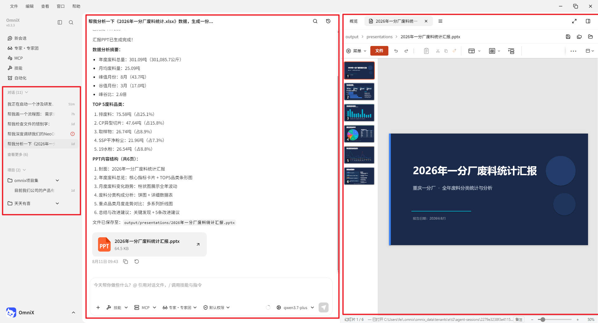
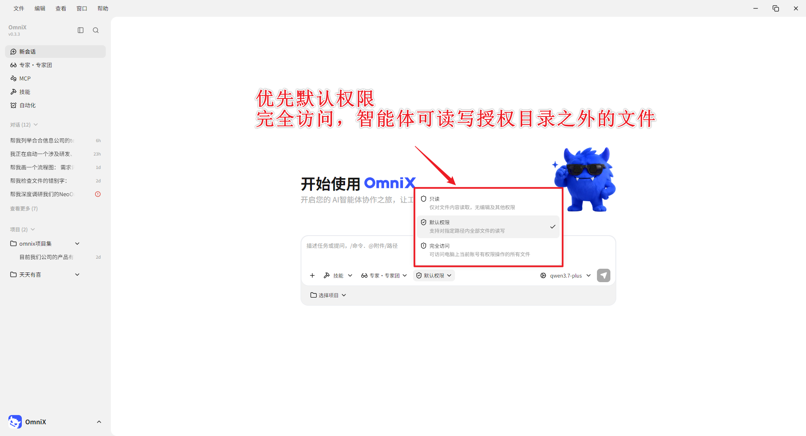
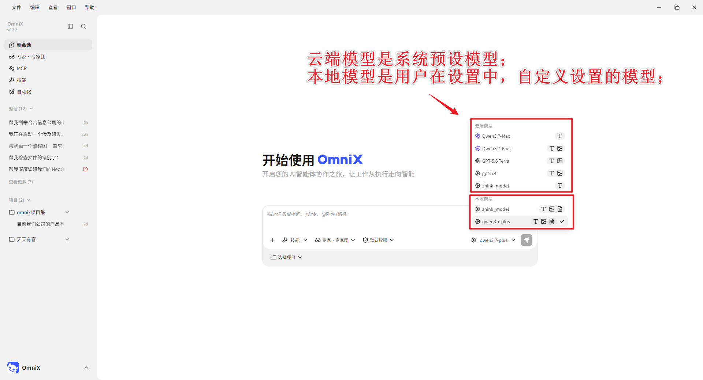

# 第 3 章 OmniX 的主界面、会话与工作区

OmniX 主界面可以理解为三个区域：左侧（侧边栏）管理会话，中间（会话区）下达和追踪任务，右侧（结果区）查看文件、变更、预览和最终产物。

## 三个区域分别做什么

| 区域 | 主要用途 | 使用时重点检查 |
| --- | --- | --- |
| 侧边栏 | 新建、搜索、切换和管理会话 | 是否进入了正确会话 |
| 会话区 | 描述需求、补充信息、确认计划 | 目标和约束是否完整 |
| 结果区 | 查看产物、全部文件、变更与预览 | 文件名、路径和改动是否符合预期 |

侧边栏的“会话”和“项目”的区别，在于你是否设置了“项目”目录。

“项目”是 OmniX 为了管理会话而设置的目录，每个会话都有一个对应的目录空间，会话可以在目录空间内进行操作。

若未设置，会在默认安装的目录下执行会话任务，会话保存在“会话”目录下。

## 为什么要隔离工作目录

工作目录既是效率设置，也是安全边界。把发票、周报、客户材料混在同一个大目录里，会增加误读、误改和信息串用的风险。

推荐按任务建项目。

同时，可以对项目的权限进行设置，当开启“允许完全访问”（开启完全访问后智能体可读写授权目录外文件，请谨慎使用，优先使用默认权限，会按任务限定目录。）

## 选择不同的模型

根据需求类型，选择不同能力的模型；不同的模型能力不一样，可适配的任务也不一样。

|任务类型|任务简单说明|核心要求|适配模型|
|---|---|---|---|
|**日常问答闲聊**|日常提问、常识解答、聊天解惑、简单咨询，无复杂专业内容|回答通俗易懂、响应快、逻辑通顺|轻量通用模型|
|**文案写作创作**|写作文、通知、文案、演讲稿、工作总结、改写润色文字|语句通顺、风格贴合场景、内容完整流畅|通用进阶模型|
|**逻辑推理解答**|数学解题、逻辑分析、问题推演、专业知识解答|答案准确、推理严谨、步骤清晰|智能推理模型|
|**长文总结改写**|长文章、文件总结、提取重点、全文改写、内容纠错| 不遗漏关键信息、总结精炼、格式规范|长文本专属模型|
|**图片识别解读**|看懂图片、识别图片文字、根据图片提问、图文解读|识图准确、文字识别无误、解读贴合图片内容|多模态图文模型|

