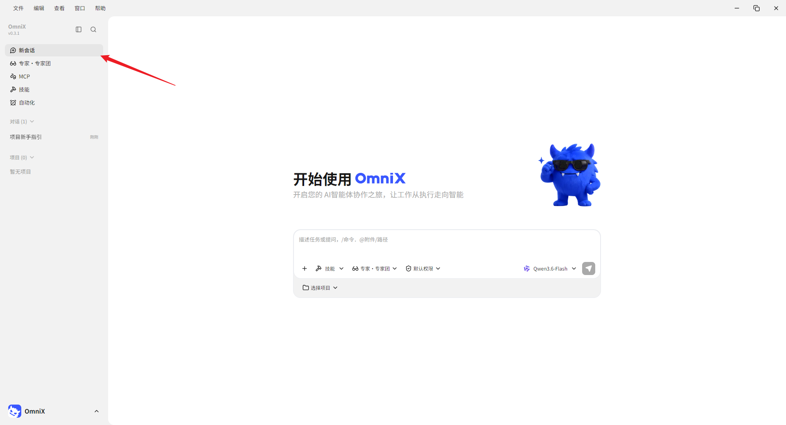
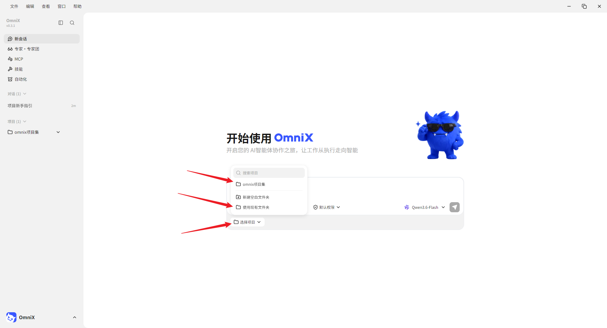
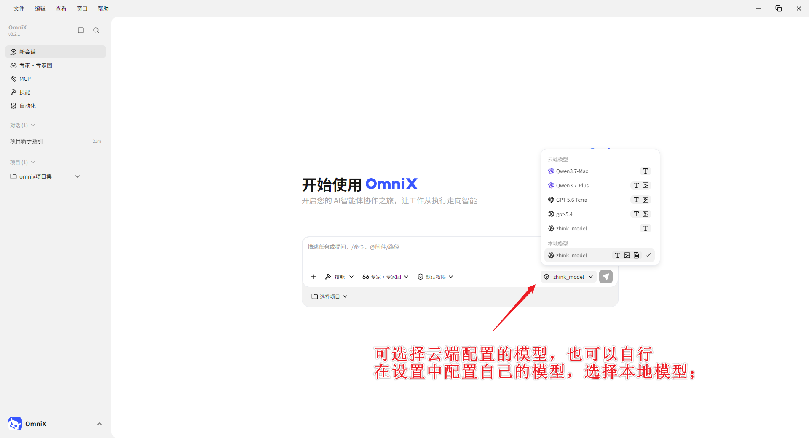
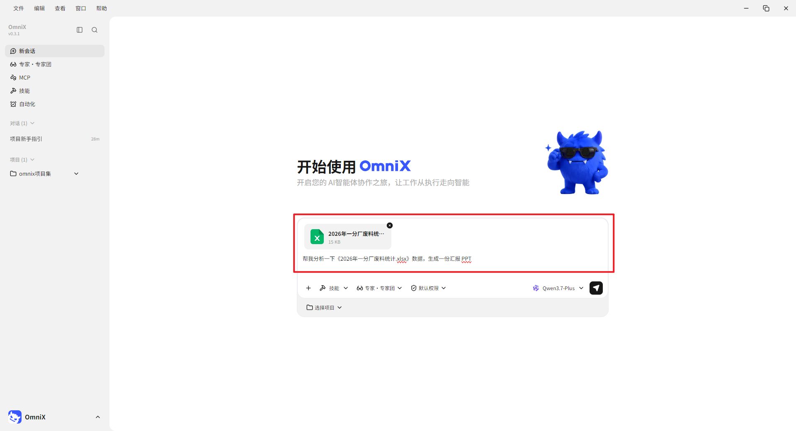
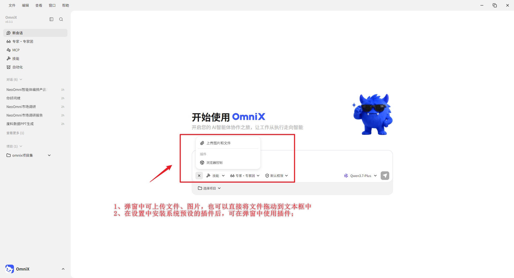
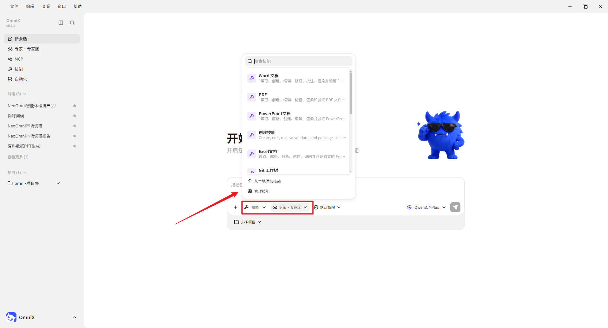
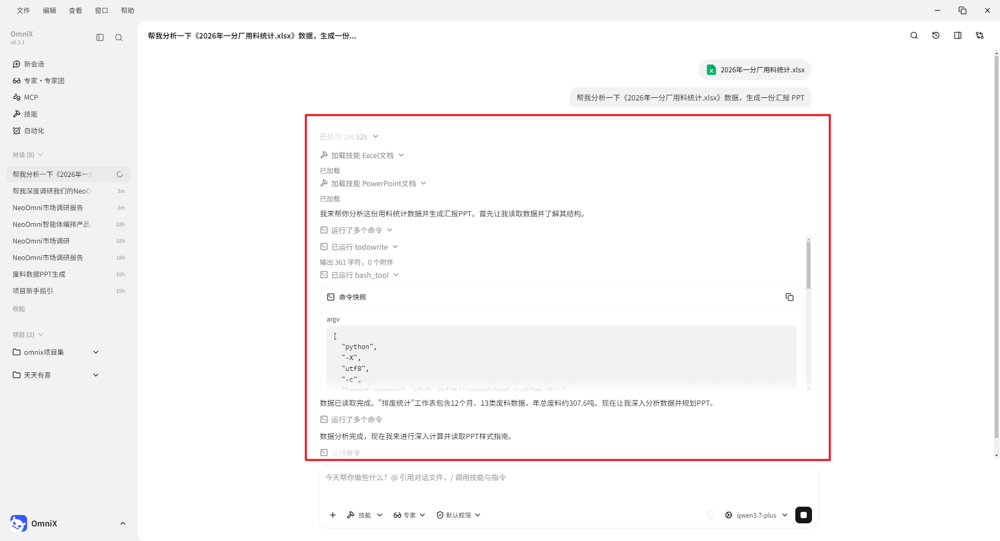
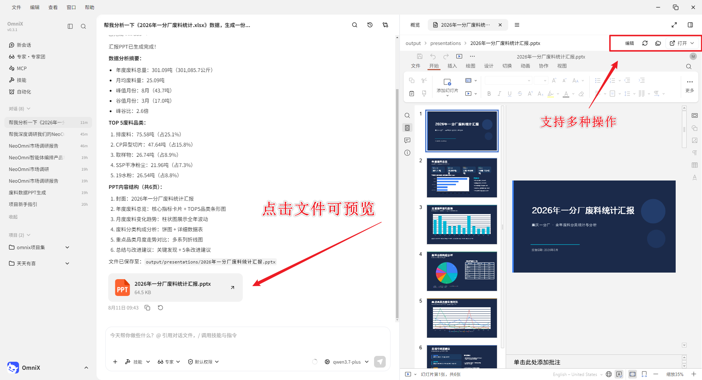

# 第 4 章 快速完成第一个 OmniX 任务


## 快速创建一个 OmniX 任务


1. 点击“新会话”；




2. 选择或创建独立工作目录；

*PS：OmniX 采用文件夹级授权与高危拦截，首次操作请先在演练目录进行、留意授权范围，处理真实业务数据前谨慎确认*




3. 选择模型，可以指定你想使用的模型，不同模型能力不同。




4. 输入任务说明，“帮我分析一下《2026年一分厂废料统计.xlsx》数据，生成一份汇报 PPT。”




5. 在弹窗中可上传文件、图片，也可以直接将文件拖动到文本框中使用。在设置中安装系统预设的插件后，也可在弹窗中使用插件;




6. 如有必要，也可以指定 技能，召唤专家、专家团，更精准的对任务进行拆解完成。




7. 发送后观察计划、工具调用和文件变更；




8. 生成的产物可以点击预览，预览区也支持直接编辑产物。同时支持本地软件打开、打开所在文件夹等操作。




## 如何写一个任务说明


|要素| 要回答的问题|
| --- | --- |
|目标| 最终要解决什么问题|
|输入| 使用哪些文件、目录或链接|
|动作| 需要分析、整理、转换还是生成|
|约束| 哪些不能改，采用什么规范|
|输出| 交付什么文件，放到哪里|
|验收| 用什么标准判断合格|

### 入门任务 A：整理文件

```
目标：整理 input 目录中的练习文件，便于按类型查找。

输入：仅处理当前工作区的 input 目录。

动作：识别文件类型，提出分类和重命名方案。

约束：不删除、不覆盖原文件；重名时保留两份并标记序号。

输出：先生成 inventory.xlsx 和 proposed-actions.md。

验收：清单文件数与 input 实际文件数一致，所有动作可追溯。

在我确认 proposed-actions.md 前，不移动文件。
```


### 入门任务 B：生成会议纪要

```
请把 input/meeting.txt 整理为结构化会议纪要。

必须包含：会议结论、待办事项、负责人、截止日期、待确认问题。

不能从原文确认的负责人或日期写“待确认”，不要自行补全。

输出 output/会议纪要.md 和 output/待办清单.xlsx。

验收：每一项结论可以在原文找到依据；待办不遗漏负责人和时间状态。
```


### 入门任务 C：Word 转 PPT


```
把 input/项目汇报.docx 转成 10 页以内的内部汇报 PPT。

受众：部门负责人；汇报时长：8 分钟。

保持原文事实和数字，不新增未经证实的数据。

结构：背景、现状、问题、方案、计划、需要决策。

使用 reference/brand-guide.pdf 中的颜色与字体规范。

输出 output/项目汇报_v1.pptx，同时提供逐页内容清单。

验收：每页只有一个核心观点，数字与原文一致，正文在投影状态可读。
```

