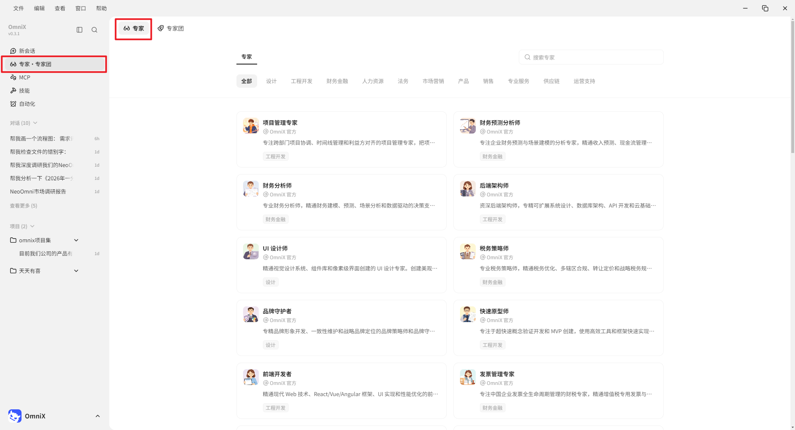
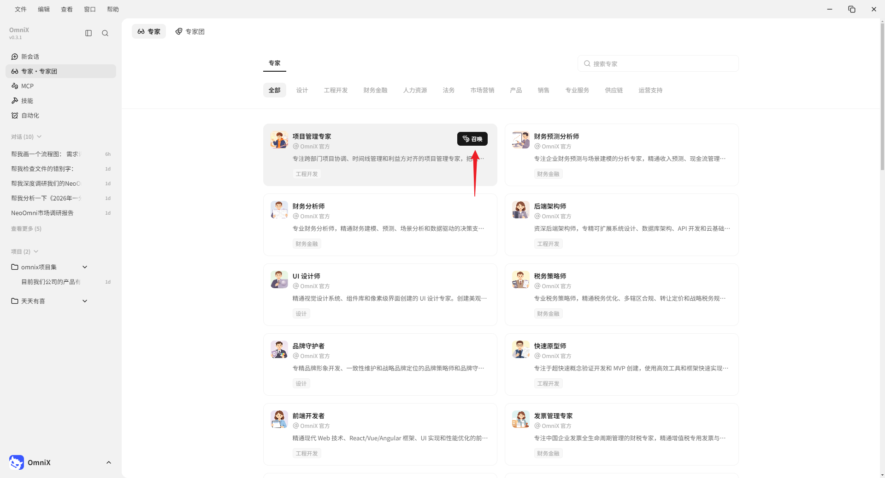
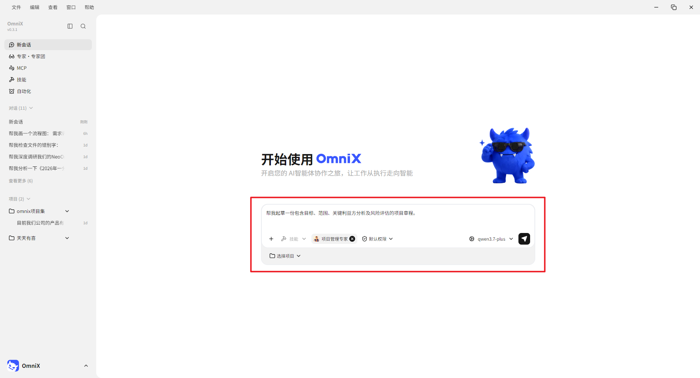
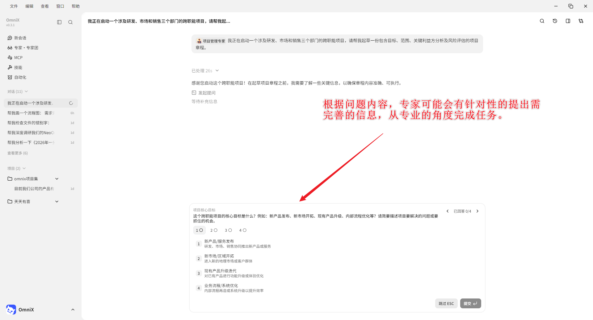

# 第 6 章 OmniX的专家和专家团

## 专家和专家团与Skill的区别

OmniX 本身是一个通用 Agent，什么任务都能接。但通用不意味着每个领域都应该用同一种方式处理。

比如，

同样是分析一份销售数据，普通 Agent 可能会读取数据、生成图表、总结趋势。数据分析专家会先理解业务目标，再确定核心指标，检查数据质量，寻找异常变化，分析可能原因，最后给出可以执行的业务建议。

同样是写一篇小红书文案，普通 Agent 可能更关注内容本身。小红书运营专家还会考虑选题、标题、开头留存、种草逻辑、平台内容生态和互动设计。

专家定义为一种角色切换机制，通过人设、方法论和技能，让 OmniX 以特定领域专家的身份执行任务。

最简单的理解是：

普通 OmniX = 通用 AI 同事

专家 = 有明确岗位和专业经验的 AI 同事

而专家团定义为一种协作执行机制。一个专家团由多位专家组成，由团长自动拆解任务、分配工作、并行执行，最后整合交付。

用户只需要告诉团长客户背景、最新需求和预期成果，不需要自己挑选团员，也不需要自己拆分任务。团长会安排内容、活动、分析等成员协作，最后汇总完整方案。

| 方式 | 本质 | 适合的问题 |
| --- | --- | --- |
| 普通任务 | 通用理解与执行 | 一次性的清楚任务 |
| Skill | 特定工具能力 | 需要稳定执行某个动作 |
| 专家 | 人设 + 方法论 + 技能 | 明确领域的单点专业问题 |
| 专家团 | 多位专家 + 协作流程 | 需要拆解、并行、汇总的复杂项目 |

## 召唤一位专家

1. 点击左侧菜单“专家·专家团”，进入“专家”模块；

2. 点击“召唤专家”；以“项目管理专家”举例

3. 提供任务内容，比如“帮我起草一份包含目标、范围、关键利益方分析及风险评估的项目章程。”

4. 专家执行任务

## 召唤一个专家团

专家团由团长负责拆解和汇总，成员按角色并行或串行执行。任务开始前先确认：成员分工是否覆盖完整、哪些步骤依赖前一步、什么时候需要人来拍板、最终由谁整合。

点击左侧菜单"专家·专家团"，进入"专家"模块，选择“专家团”，点击召唤

