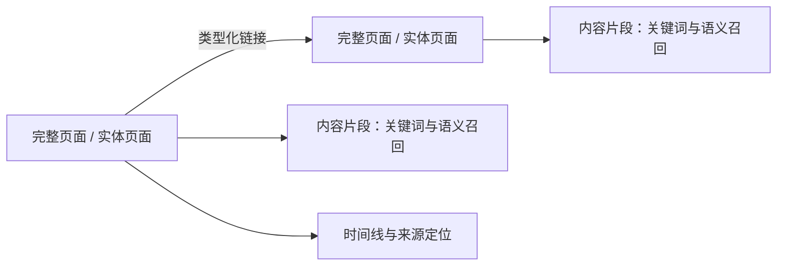
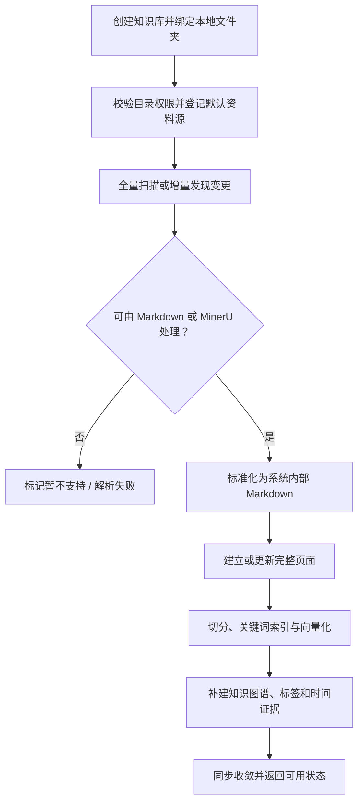
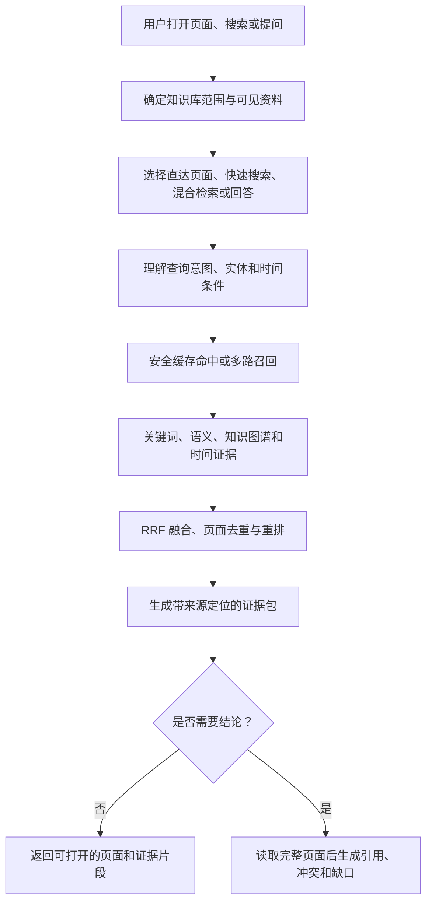
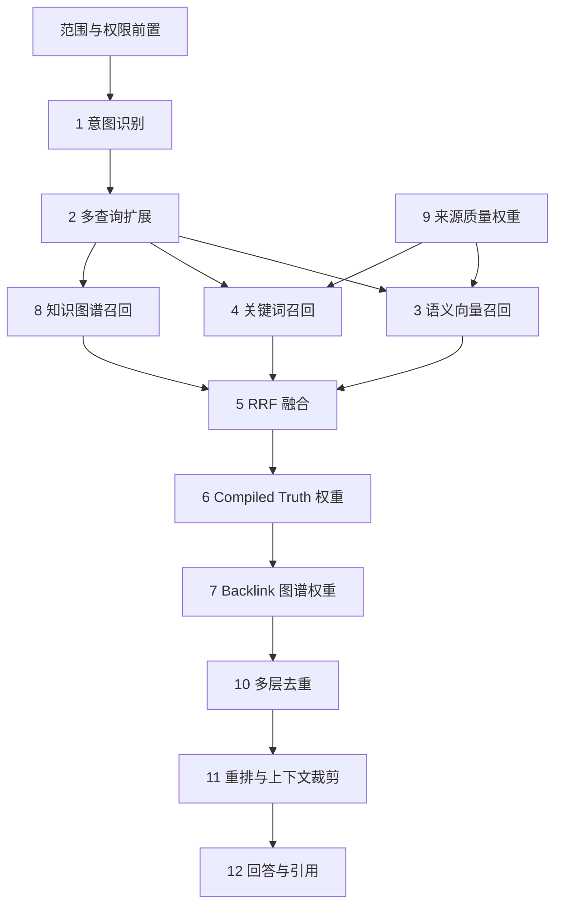

# OmniX 本地知识库产品需求文档（内部版）

## 1. 文档目的

这份文档用于把 OmniX 本地知识库的核心需求、产品边界和落地重点一次性讲清楚，方便产品、设计、研发和管理层统一认知。

OmniX 本地知识库是我们面向 AI Agent 时代自主设计、自主研发的知识底座产品。方案参考了行业内关于本地知识库、智能检索和长期记忆的成熟实践，但产品定位、能力组合、交互路径和落地方式均服务于 OmniX 自身场景，不依赖外部产品品牌叙事。

## 2. 产品定义

OmniX 本地知识库是面向 AI Agent 的知识底座产品。

它解决的不是“怎么把一段文本喂给模型”，而是下面这组连续问题：

- 资料如何进入系统，并且默认留在本地或用户控制的数据库里。
- 资料进入后如何从“原始文档”变成“可被回答的知识结构”。
- 智能体提问时如何拿到答案，而不是一堆原文碎片。
- 当系统接入多知识库、多资料源或外部智能体时，如何避免串库和越权。
- 知识库如何随着时间持续维护，而不是导入一次后很快腐烂。

一句话定义：

> OmniX 本地知识库是一个让 AI Agent 拥有长期记忆、结构化知识和可信检索能力的本地优先知识底座。

## 3. 目标用户

### 3.1 主要用户

- 已经在本地积累了较多资料，希望把这些资料变成可搜索、可提问知识库的个人用户
- 日常使用 AI 助手，希望 AI 能结合自己的资料回答问题，而不是只回答通用知识的用户
- 主要使用 Markdown、Obsidian、项目文档、研究资料等进行个人知识管理的用户

### 3.2 扩展用户

- 后续可能扩展到需要共享知识沉淀的小团队或工作室
- 希望给内部 AI 助手补充私有知识上下文的技术团队
- 对本地优先、可控部署有明确要求的组织

### 3.3 用户共性

- 资料主要已经存在于本地文件或本地文件夹中
- 希望通过“选择文件/文件夹后直接导入”的方式快速开始使用
- 不希望默认走云托管，希望数据尽量保留在本地
- 不希望理解数据库、向量索引等底层概念才能开始使用
- 希望搜索结果和答案都能追溯到原始资料，而不是模型直接编造结论

## 4. 要解决的核心问题

### 4.1 传统 RAG 的三类痛点

- 切块会切碎语义。用户需要的是完整事实、关系和上下文，不是断头断尾的片段。
- 相似不等于重要。仅靠向量相似度，容易召回“像”的内容，而不是“关键”的内容。
- 每次都从零开始。普通 RAG 是临时检索、临时拼接、临时理解，缺少持续沉淀。

### 4.2 OmniX 本地知识库的产品回答

| 传统 RAG 问题 | OmniX 的解决机制 | 用户得到的结果 |
|---|---|---|
| 切块切碎语义 | 页面是完整知识单元，片段只用于召回；命中后可回到完整页面、原文件、关系和时间线 | 不只看到孤立片段，而能看到事实的上下文和来源 |
| 相似不等于重要 | 组合关键词、语义、关系、时间等证据，再做融合、去重和重排 | 找到的不只是“像”的内容，而是更可能回答问题的内容 |
| 每次都从零开始 | 绑定文件夹后持续增量同步，持续维护页面、索引、关系和时间结构 | 新资料自动进入已有知识体系，知识库会累积而不是重复构建 |

在此基础上，系统保留知识库和资料源隔离，并在回答中返回引用、冲突和信息缺口，而不是用模型补全没有证据的结论。

## 5. 当前阶段目标与验收标准

### 5.1 当前阶段目标

让一个普通用户把本地资料接进来后，能够稳定获得一个可搜索、可提问、可追溯、可持续维护的本地知识库能力。

### 5.2 验收标准

- 用户可以在短时间内创建一个本地知识库。
- 用户可以选择本地文件夹并完成资料导入。
- 系统可以把资料变成页面、片段、关系、时间线和索引。
- 用户可以用自然语言拿到带来源的答案，而不是只有搜索结果。
- 智能体只能访问被授权的知识库和资料源。
- 导入后的知识库可以随着新资料进入而继续维护，不需要每次重建。
- 用户能清楚知道数据放在哪里、当前进度到哪一步、下一步该做什么。

## 6. 产品原则

1. 本地优先。默认数据落在用户机器或用户控制的数据库中。
2. 先让资料进来，再谈更复杂的智能能力。
3. 每个复杂步骤必须可见，不能只有“黑盒处理中”。
4. 搜索结果必须可追到页面和来源。
5. 单用户场景默认无显式权限管理；进入多库、多源或外部接入场景后，隔离能力必须存在。
6. 产品语言面向普通用户，不强迫用户理解底层实现。
7. 允许高级用户看到更多细节，但不能把复杂度强塞给所有人。

## 7. 产品定位与边界

### 7.1 产品是什么

- 一个本地优先的通用文件知识库产品
- 一个支持 Word、Excel、PDF、PPT、TXT、Markdown 等常见文件解析、导入和知识化处理的系统
- 一个给智能体使用的长期记忆与检索层
- 一个能把“原始资料”转成“可搜索、可提问、可回答知识”的中间层

### 7.2 当前阶段边界

当前阶段，产品重点放在“本地通用文件解析 + 知识化处理 + 搜索问答”这一条主线上，不把资源分散到以下方向：

- 单纯的 Markdown 笔记编辑工具
- 仅依赖全文检索的文档搜索产品
- 仅提供向量召回能力的底层 RAG 组件
- 以演示效果为主、缺少真实数据闭环的展示型产品
- 强依赖云端托管和全量上传的服务模式

## 8. 产品信息架构

OmniX 本地知识库的认知模型有两条轴，产品必须把它讲清楚：

- 知识库实例：查哪一套知识库数据
- 资料源：查知识库中的哪一个文件来源、仓库来源或同步来源

这意味着产品不是“一个搜索框搜全部”，而是：

- 可以有多个知识库实例
- 每个知识库实例里可以有多个资料源
- 在多库、多源或外部接入场景下，查询、写入和可见范围都同时受这两层约束

## 9. 核心业务链路

当前版本后半段最重要的是两条链路：

- 写入链：把本地文件或文件夹变成可用知识库
- 搜索链：把已经进入知识库的内容变成可回答结果

## 10. 写入链

写入链回答的是：一份资料从进入 OmniX 开始，何时只是“已保存”，何时已经“可关键词搜索”，何时才算“可被语义检索和可信回答”。这三个状态必须分开，不能用一个模糊的“导入成功”掩盖中间失败。

### 10.1 当前实现边界与产品承诺

用户只需要做一件事：创建知识库时绑定一个本地文件夹。客户端首次全量扫描，之后持续监听或增量扫描；不提供上传、逐文件导入或手工粘贴入口。

原文件始终留在绑定目录，客户端不移动、不改写，也不会在用户目录生成解析后的 Markdown 副本。Markdown 直接进入写入链；PDF、Word、Excel、PPT 等通用文件由 MinerU 解析为系统内部 Markdown，再进入同一条链路。尚无解析器的文件只显示为“暂不支持 / 等待解析”，不能显示为已知识化。

```text
用户目录中的原文件
  -> 系统内部 Markdown（原文件不变，可重新解析）
  -> pages（完整页面：正文 / Compiled Truth、frontmatter、时间线）
  -> content_chunks（片段原文、页内定位、关键词索引、可选向量）
  -> links / timeline（知识图谱与时间证据，增强层）
```

完整页面和片段不是两份重复数据，而是两个不同职责的读模型：`pages` 保存可完整阅读的知识页面；`content_chunks` 把页面中适合检索的局部文本连同来源定位和向量保存下来。搜索先用片段召回证据，再读取对应的完整页面组织上下文；任何结论都可以回到绑定目录中的原始文件。

页面中的 Compiled Truth 是在有足够来源支撑时形成的“当前最佳理解”，时间线则保留可追溯的事件与证据。首次解析文件时，系统先保存完整原文页面；尚未形成可靠综合结论的内容不能假装为 Compiled Truth，也不应获得权威页面权重。

知识图谱以页面和实体为节点，以带类型、可回到原文的链接为边。它不取代全文和语义检索，而是在“谁与谁有关、谁在哪个组织、两者如何连接”这类问题中提供确定的关系证据。



当前代码已具备 Markdown 同步、页面 / 片段 / 向量存储和混合检索能力；代码文件可按策略同步，图片能力受多模态配置控制。MinerU 解析通用文件是产品要补齐的目录同步能力，接入后必须复用页面、片段和检索主链，而不是另建上传通路。

### 10.2 总体流程



### 10.3 写入链节点定义

#### 节点 0：创建知识库并绑定本地文件夹

- **输入：** 知识库名称和用户在客户端选择的一个本地文件夹绝对路径。
- **系统动作：** 校验目录存在、客户端具备读取权限且路径可规范化；创建知识库，并把该目录登记为默认资料源根目录。产品界面只展示这一条绑定关系。
- **输出：** 固定的知识库、默认资料源和目录根路径映射。后续产生的页面、片段、索引和结构化数据都归入该范围。
- **异常与规则：** 目录不存在、无读取权限、路径失效或绑定关系冲突时，不创建半成品知识库。用户修改目录位置时必须执行重新绑定，系统不得静默改扫其他目录。

#### 节点 1：扫描目录并识别变更

- **输入：** 已绑定的目录根路径和触发方式：首次创建、手动刷新、文件监听或定时增量扫描。
- **系统动作：** 仅从绑定根目录向下读取文件。首次生成全量清单；后续依据路径、文件状态和内容哈希识别新增、修改、重命名、删除和无变化项，并过滤隐藏目录、依赖目录和非资料文件。
- **输出：** 本轮可执行清单，以及每个文件的类型、变更类型和处理状态。
- **异常与规则：** 目录被删除、权限变化、根路径被替换或扫描中断时，状态为“目录不可访问 / 同步待恢复”。已有索引可以保留但必须标记可能过期，客户端不得扩大扫描范围。

#### 节点 2：校验文件并路由解析器

- **输入：** 清单中的候选文件，以及路径、大小、类型探测、内容哈希和读取结果。
- **系统动作：** 校验文件仍在绑定目录内、可读取且符合大小与安全规则；Markdown 直接路由到 Markdown 解析器，代码文件按同步策略路由，PDF、Word、Excel、PPT 路由到 MinerU。无法处理的类型不进入页面或索引写入。
- **输出：** 每个文件得到“可处理、暂不支持、解析失败或隔离”的明确决定和原因。
- **异常与规则：** 校验或解析前置失败不得生成半个页面、半套片段或消耗向量化预算。高置信度噪声内容隔离并排除检索；同一文件持续失败时允许后续批次继续，但必须保留待修复记录。

#### 节点 3：标准化为系统内部 Markdown

- **输入：** 原始 Markdown，或 MinerU 输出的 Markdown、结构信息和原文定位。
- **系统动作：** 统一整理标题、正文、前置元数据、可识别时间信息和来源定位；PDF 保留页码，PPT 保留幻灯片，Excel 保留工作表和单元格等可核验位置。解析 Markdown 仅作为应用内部数据，不写回用户目录。
- **输出：** 可重建的标准 Markdown、解析器版本、原文件哈希和定位映射。
- **异常与规则：** 解析成功不等于已可提问。原文件路径、文件哈希和定位映射缺失时，内容不能进入“可追溯”状态；解析器升级或源文件变化后，系统必须能够据此重新解析。

#### 节点 4：建立完整页面并维护版本

- **输入：** 已验证的标准 Markdown、来源凭据和现有页面记录。
- **系统动作：** 解析并持久化完整页面，包括正文、frontmatter、时间线和页面标识；在证据充分时可形成 Compiled Truth。页面同时保存原始相对路径、内容哈希、解析器版本和定位映射。只有内容或来源身份真正变化时，才创建或更新页面。
- **输出：** 可被完整阅读的页面读模型和稳定页面标识。检索命中片段后，系统依靠该页面恢复完整上下文，而非只展示孤立切块。
- **异常与规则：** 原文件是用户资料，数据库写入不得改动它。持久化必须原子完成，失败后可安全重试；无变化的文件不得重复切分或重复向量化。没有可回溯证据的模型综合内容不得写入 Compiled Truth。

#### 节点 5：切分页面并建立检索索引

- **输入：** 已持久化页面的正文、标题、时间线和可识别的代码块。
- **系统动作：** 按段落和语义边界生成带页内位置与来源定位的内容片段；片段原文进入关键词索引，并按配置生成向量。页面和片段始终通过页面标识关联。
- **输出：** 关键词可检索的证据片段，以及处于“已生成、待生成或失败”状态的语义向量。
- **异常与规则：** 向量不可用、模型超时或预算受限时，页面仍可关键词搜索，但必须标记为“向量待完成”，不能报告为完全可用。更换嵌入模型或维度后，旧向量必须失效并回填，不得混用向量空间。

#### 节点 6：补建知识图谱、标签和时间证据

- **输入：** 页面中的显式 Markdown 链接、前置元数据、标签和可解析的时间信息。
- **系统动作：** 以页面和实体为节点，将可验证的链接写入带类型的图谱边；同时将标签、别名和时间信息写入对应索引。图谱用于关系检索、路径解释和结果排序，但不替代原文证据。
- **输出：** 可遍历、可回到页面和原始文件定位的知识图谱边，以及标签、别名与时间证据。
- **异常与规则：** 该节点是增强层，失败不能阻断页面和关键词索引；系统不得把没有来源的推测写成图谱事实或关系。

#### 节点 7：同步收敛、回填与状态回执

- **输入：** 本轮变更清单、页面路径映射、索引状态和失败记录。
- **系统动作：** 对新增、修改、重命名、删除和无变化项幂等收敛；更新或软删除对应页面、片段和关系；对待向量化、嵌入模型变更或解析器升级的页面安排回填。将结果汇总为文件级和批次级状态。
- **输出：** 当前目录的同步位置、可用页面数、关键词可用数、向量待完成数、失败项和可重试动作。
- **异常与规则：** “扫描完成”不等于“知识库已可用”。资料源仍有解析失败、隔离文件或未嵌入片段时，健康状态必须持续暴露；用户应可重试失败项或只执行回填，不必重做整个目录。

### 10.4 写入状态机与完成定义

| 状态 | 含义 | 用户可以做什么 | 不可误导为 |
|---|---|---|---|
| 待扫描 | 文件夹已绑定，尚未形成本轮文件清单 | 等待扫描或手动刷新 | 已导入 |
| 待解析 | 已进入清单，尚未得到标准页面 | 查看进度 | 可搜索 |
| 等待解析器 / 暂不支持 | 文件已被发现，但当前没有对应解析器 | 查看文件类型和原因，等待能力接入或忽略 | 已知识化、可问答 |
| 页面已写入 | 页面和来源凭据已持久化 | 查看来源定位，在绑定目录中编辑原文件 | 已完成全部索引 |
| 关键词可检索 | 页面已切分并可做全文 / 关键词召回 | 搜索明确名称和词组 | 语义检索已可用 |
| 向量待完成 | 页面存在但尚未嵌入或需要重新嵌入 | 等待 / 执行回填 | 完全可用 |
| 完全可用 | 页面、关键词片段和当前向量空间均已就绪；结构增强尽力完成 | 自然语言搜索、问答和追溯 | 永远无需维护 |
| 已隔离 / 待修复 | 内容质量或解析问题要求处理 | 查看原因、修复、重试或明确放行 | 正常参与检索 |

写入链的验收不是“文件夹已绑定”或“扫描命令结束”，而是目录中的每一项资料都有一个可解释的最终状态；所有“完全可用”的页面都能追到绑定目录中的原文件，所有非完全可用项都能说明差在哪一步、是否影响关键词搜索、由谁处理。

## 11. 搜索链

搜索链回答的是：系统如何在正确的知识库范围内，把一次提问变成足以回答的证据，而不是把一串看起来相似的片段交给用户。

核心检索不是单一向量搜索，而是以“关键词 + 语义 + 知识图谱 + 时间证据”为基础的混合检索。关键词保证名称、术语和文件线索的确定性；语义召回处理同义表达和模糊问题；图谱和时间信息只在已有来源时增强结果。不同召回路径通过排名融合合并，不能直接比较不同算法的原始分数。

搜索与回答必须拆成两个责任层：

1. **检索层**负责返回页面级结果和片段级证据，说明它来自哪个页面、为什么命中、能回到原文件的什么位置。
2. **回答层**在需要归纳、比较、冲突判断或多页推理时，先读取必要的完整页面，再依据证据生成带引用的结论。没有足够证据时，必须说明没有找到，不能用模型常识补全。



### 11.1 搜索入口与路由规则

| 用户意图 | 产品入口 | 系统应做什么 | 不应做什么 |
|---|---|---|---|
| 已知页面或来源文件 | 直达页面 | 读取完整页面及来源定位 | 先做语义搜索 |
| 已知名称、术语、短语或文件线索 | 快速搜索 | 优先关键词召回，返回命中片段供确认 | 把片段当作完整事实 |
| 自然语言问题、同义表达、模糊问题 | 混合检索 | 并行组合关键词、语义和可用结构化证据 | 只按向量相似度排序 |
| 关系或时间问题 | 混合检索 + 图谱 / 时间召回 | 在已有图谱关系、时间线和时间范围内补充证据 | 凭模型猜测关系或让旧资料淹没近期事件 |
| 需要结论、冲突或信息缺口 | 回答 | 先取得证据包和完整页面，再生成引用明确的答案 | 在检索为空时直接编造回答 |

### 11.2 十二步检索与回答链

下表对应 PDF 中的 12 步检索栈，但产品不应把它理解成不可变的串行脚本：步骤 3、4、8 可并行生成候选，步骤 9 在召回阶段生效，步骤 11 依配置启用。产品展示可以保持 12 个可解释阶段，底层实现则以正确的依赖关系和降级路径为准。

在进入第 1 步前，系统先锁定知识库、绑定目录对应的资料范围和外部调用方权限。语义缓存可在同一范围、同一嵌入空间和同一检索配置下直接返回已有证据包；缓存未命中才进入下表，缓存故障不得阻断检索。



| 步骤 | 节点 | 系统必须做什么 | 输出与降级规则 |
|---|---|---|---|
| 1 | 意图识别 | 根据查询识别实体、关系、事件、时间和一般问题，确定检索深度、时间偏好与后续开关。时间 / 事件问题应优先保留时间线，不应被“当前总结”压过。 | 输出查询计划。分类不准时退化为通用混合检索，不得直接返回空结果。 |
| 2 | 多查询扩展 | 在当前模式允许且模型可用时，将原问题扩展为少量等价表达；原问题必须保留，扩展输入和输出都需安全处理。 | 输出一到多条查询。扩展失败或不适合短查询时只使用原问题。 |
| 3 | 语义向量召回 | 对每条查询生成嵌入，在 `content_chunks` 中按语义相似度召回候选；同一页面只保留最强片段参与后续排序。 | 输出带页面和来源定位的语义候选。嵌入不可用、超时或向量待回填时跳过此臂，不中断检索。 |
| 4 | 关键词召回 | 使用全文索引匹配名称、术语、文件线索和精确短语。 | 输出关键词候选。该步骤不依赖嵌入服务，必须始终可用。 |
| 5 | RRF 融合 | 用互惠排名融合合并关键词、语义和图谱候选，不直接相加不同算法的原始分数。 | 输出统一候选池及各召回路径。任何一个增强臂缺失时，对剩余候选正常融合。 |
| 6 | Compiled Truth 权重 | 对已沉淀的当前知识页面给予受限提升，使权威页面优先于零散提及；时间 / 事件问题关闭或降低该提升。 | 输出符合问题类型的基础排序。该权重不能覆盖明确的时间约束或来源范围。 |
| 7 | Backlink 图谱权重 | 根据页面被其他可信页面引用的程度做温和提升，反映其在知识图谱中的连接度。 | 输出带图谱权重的候选。没有图谱或图谱数据异常时不加分，不影响基础检索。 |
| 8 | 知识图谱召回 | 对关系问题解析可信实体，在已授权范围内沿带类型的边有限跳数遍历；将路径和边类型作为候选证据。 | 输出图谱候选和可解释路径。实体无法可靠解析、图谱为空或遍历失败时该臂为空，不得猜测关系。 |
| 9 | 来源质量权重 | 根据目录策略和内容质量对已明确的高价值资料、低信号资料或明确排除路径进行排序调整。 | 输出带来源质量信号的候选。该策略必须可配置、可审计，且不能绕过范围和隔离规则。 |
| 10 | 多层去重 | 限制同页片段数量，删除高度相似片段，保持页面类型多样性，并保证关键页面的完整知识片段不会被全部挤掉。 | 输出紧凑、非重复的页面级结果与片段证据。去重不得删除唯一的高质量证据。 |
| 11 | 重排与上下文裁剪 | 在启用重排器时，对头部候选进行交叉编码重排；再依问题类型、结果断层和上下文预算确定交给回答层的证据数量。 | 输出高置信证据包。重排失败保留第 10 步顺序；裁剪至少保留首条可用证据，并说明结果被裁剪。 |
| 12 | 回答与引用 | 纯搜索直接返回证据包；需要结论时先读取必要的完整页面，再生成结论、引用、冲突和信息缺口。 | 输出可打开的结果或带引用的答案。无命中、无权限与证据不足必须明确区分，不能用模型常识补全。 |

检索完成后，系统异步记录缓存命中、各召回臂是否启用、结果数、耗时和降级原因，用于质量评估和问题定位；这些记录不得改变当前回答。

### 11.3 搜索输出契约

| 输出层 | 必须包含 | 面向用户的意义 |
|---|---|---|
| 检索结果 | 标题、页面标识、片段、匹配理由、命中路径、内容告警 | 知道“找到了什么”、为什么命中，以及哪些检索步骤参与了排序 |
| 来源定位 | 绑定目录中的原始相对路径，以及页码、幻灯片、工作表或单元格等定位 | 可以回到原始资料核验 |
| 图谱 / 时间证据 | 边类型、图谱路径、事件时间或查询时间范围 | 知道结论不是把无关片段拼在一起 |
| 回答 | 结论、逐条引用、冲突、未知项和时间边界 | 可以区分已知事实、推断和缺口 |
| 降级说明 | 关键词回退、向量待回填、结果被预算裁剪或无权限等 | 知道结果的能力边界，而不是误信“没搜到就是不存在” |

### 11.4 搜索链的降级原则

1. 嵌入模型不可用时，保留关键词和可用的图谱检索，不将搜索整体报错。
2. 查询扩展、图谱 / 时间增强或重排器失败时，回到已完成的候选排序，并留下可观测记录。
3. 缓存不可用时重新检索；缓存永远不能跨资料源、跨授权范围或跨向量空间复用。
4. 没有权限时返回拒绝；没有命中时返回“未找到”；证据不足时返回“无法确认”。三者不能混为同一种空结果。
5. 所有降级都不得绕过隔离内容、来源边界和引用要求。

搜索链的验收不是“能返回若干片段”，而是用户和 Agent 都能看清检索范围、每条证据的出处和强度，以及答案到底基于什么、还缺什么。

## 12. 当前阶段要求

当前阶段重点不是堆叠文件格式或检索名词，而是完成“本地目录资料可持续进入、可被找到、可回到原文核验”的闭环。

### 12.1 写入链要求

- 用户只需绑定一个本地文件夹；原文件始终不被移动或改写。
- Markdown 直接同步；常见通用文件通过 MinerU 解析为内部 Markdown，并保留可回到原文件的定位。
- 每份资料必须先形成完整页面，再生成片段和索引；不得只有向量而无法阅读完整上下文。
- 文件状态必须区分待解析、关键词可检索、向量待完成、完全可用和待修复，不能用“导入成功”掩盖差异。
- 后续变更必须增量收敛，且能够重试失败项、回填向量和随解析器版本重建。

### 12.2 搜索链要求

- 关键词、语义、知识图谱和时间证据共同参与检索；关键词路径在没有嵌入模型时仍可用。
- 不同召回路径使用排名融合，随后进行页面级去重和重排，避免同一页面的多个片段占满结果。
- 搜索结果必须携带命中片段、匹配理由和原始文件定位；回答必须在必要时读取完整页面。
- 没有命中、没有权限和证据不足必须返回不同结果；不允许把模型常识包装为本地资料结论。

### 12.3 体验要求

- 用户主路径必须清晰：创建知识库、绑定文件夹、等待同步完成、搜索或提问。
- 用户不需要理解 Markdown、向量、RRF 或资料源等内部概念，但可以看到文件状态、失败原因和来源定位。
- 页面、搜索结果和答案都应提供返回原文件的入口；用户始终能知道资料处理到哪一步、当前能做什么。

## 13. 版本路线

### V1

完成单文件夹绑定、Markdown 直接同步、MinerU 通用文件解析、完整页面与片段索引、关键词 / 语义混合检索，以及带原文件定位的搜索和回答。

### V1.1

补齐目录监听、失败重试、向量回填、解析器版本重建、知识图谱 / 时间证据补建和资料源健康状态。

### V2

补强多模态解析、夜间维护、冲突整理和更丰富的知识结构能力；这些能力必须建立在 V1 的页面、片段和来源追溯链路之上。

## 14. 验收标准

1. 用户创建知识库并绑定目录后，系统能在不改动原文件的前提下完成首次扫描和后续增量同步。
2. 支持的文件能形成完整页面、关键词片段和可选向量；未支持或失败的文件有明确状态，不能伪装为可问答。
3. 用户搜索精确术语和自然语言问题时，系统分别能走关键词和混合检索，并避免单页片段重复占据结果。
4. 每条搜索证据和回答结论都能回到完整页面及原始文件定位；证据不足、无结果和无权限有明确区分。
5. 文件被修改、移动、删除，或嵌入模型、解析器升级后，系统能够定向更新或回填，不必重建整个知识库。

## 15. 当前阶段结论

- 当前版本的核心不是上传文件或堆积向量，而是把用户绑定目录中的资料稳定转成可阅读、可检索、可追溯的页面体系。
- 页面保证完整上下文，片段保证召回效率，知识图谱和时间证据保证结果不只依赖“相似”；三者共同支撑可信回答。
- V1 必须先把目录同步、通用文件解析、混合检索和来源追溯做成闭环，再扩展多模态和自动维护能力。
